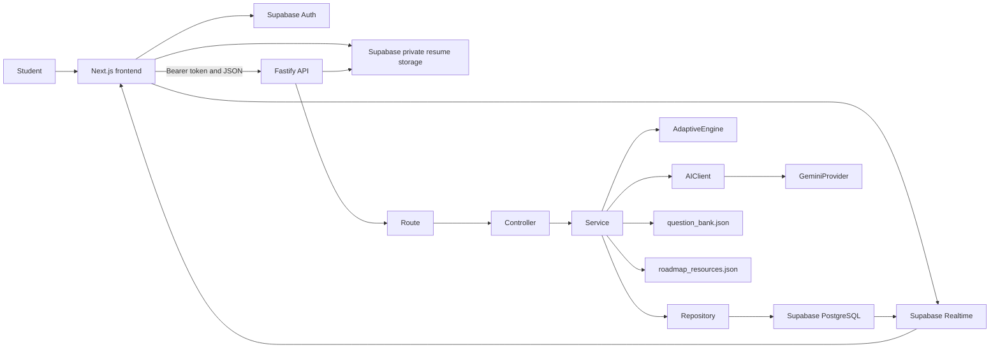
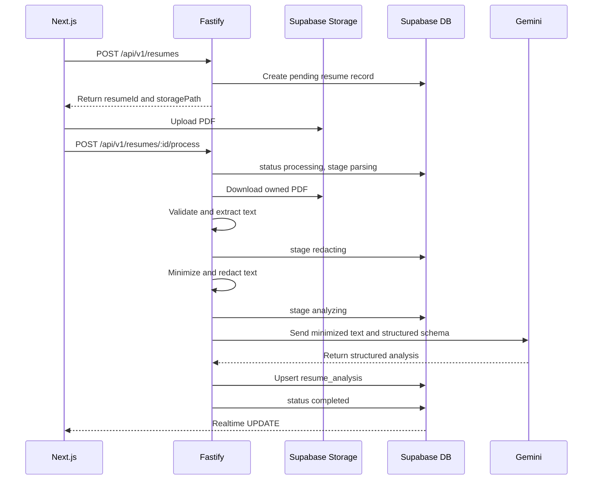

# InterviewForge: Master Product and System Architecture

Document version: `1.0.0`

Last reviewed: July 15, 2026

Target candidate-ready date: August 1, 2026

Project directory: `D:\Life\Academic\Coding\InterviewForge`

This is the authoritative architecture and implementation handoff for InterviewForge. It consolidates the original project plan, approved scope changes, the revised visual system, and the technical consistency improvements identified during review.

## 1. Product context

InterviewForge is an AI-assisted interview practice platform for students and early-career candidates. It adapts questions to a candidate's resume, target job description, answers, and demonstrated weaknesses.

The product helps users understand:

- What interview questions they may be asked.
- How well they answered each question.
- Which technical and communication topics need improvement.
- What they should practice next.
- Whether their interview performance is improving over time.

The main differentiator is the deterministic adaptive interview engine:

```text
Candidate answers a question
        ->
Answer is evaluated
        ->
AdaptiveEngine examines the result
        ->
Difficulty, topic, and follow-up strategy are selected
        ->
The next question is asked
```

### Product principles

- **Focused:** every screen supports a specific user task.
- **Honest:** feedback is clear, evidence-based, and does not pretend to be a hiring verdict.
- **Encouraging:** the product motivates improvement without gamification pressure.
- **Accessible:** keyboard-friendly, reduced-motion aware, responsive, and WCAG AA oriented.
- **Clean:** hierarchy comes from spacing, typography, and restrained color.

## 2. Approved changes included in this version

- Job descriptions are paste-only in the MVP. JD PDF upload is postponed.
- Interviews contain either 5 or 10 questions, selected by the user. The default is 5.
- The AdaptiveEngine is versioned as `adaptive-v1` and the version is stored with each interview.
- The visual system is **Forge Blue + Slate**, based on the supplied dashboard reference.
- `answers.client_request_id` is stored and uniquely constrained for idempotency.
- `interviews.started_at` is nullable until the interview starts.
- Missing JD retry, evaluation retry, and interview deletion routes are included.
- Realtime publication and subscription ordering are explicitly defined.
- AI metadata includes provider, model, prompt version, schema version, and rubric version where applicable.
- Generated questions preserve question-bank provenance and source type.
- Expected concepts and evaluation rubrics are never sent to the candidate before answer submission.
- The health endpoint is explicitly unversioned at `/health`.
- RLS examples use `(select auth.uid()) = user_id` and include `WITH CHECK` for updates.

## 3. Instructions for implementation agents

Before modifying anything:

1. Confirm that the active workspace is exactly `D:\Life\Academic\Coding\InterviewForge`.
2. Inspect folder contents and Git status.
3. Do not create project files outside this directory.
4. Preserve existing files and user changes.
5. Implement one vertical feature at a time and verify it before continuing.
6. Do not attempt the entire application in one implementation pass.
7. Keep the architecture clean, but do not add infrastructure unless the MVP needs it.
8. Make reasonable local decisions without repeatedly stopping for minor questions.
9. Create `PRODUCT.md` and `DESIGN.md` from this architecture before major UI implementation.
10. Use the latest stable, security-patched package versions available at implementation time.
11. Pin dependency versions and commit both application lockfiles.
12. Stop at the boundary specified by the current task.

## 4. Locked technical decisions

These decisions must not change without a concrete technical reason.

### 4.1 Repository

Use one ordinary GitHub repository with two independent applications:

```text
frontend/
backend/
```

This is not a monorepo workspace setup.

Do not use:

- Turborepo
- npm workspaces
- pnpm workspaces
- Nx
- Shared-package orchestration
- Microservice orchestration

Each application has its own `package.json`, `package-lock.json`, TypeScript configuration, build scripts, and dependencies. The repository root contains documentation, Supabase migrations, GitHub Actions, and common project files. No root package is required.

### 4.2 Frontend

- Next.js App Router
- React
- TypeScript
- Tailwind CSS
- A small, selected set of shadcn/ui components
- Geist Sans and Geist Mono
- Lucide React icons
- Recharts for dashboard charts
- npm

Next.js is only the frontend framework.

Do not use:

- Next.js Route Handlers for application business APIs
- Next.js Server Actions for business operations
- Direct database business logic inside Next.js
- Next.js as the backend

Static layouts can remain Server Components. Interactive authenticated pages, charts, uploads, voice controls, and interview screens use Client Components at the narrowest practical boundary.

If the installed Next.js version uses `proxy.ts` for navigation-level route protection, treat it only as a user-experience layer. Fastify authorization and Supabase RLS remain the security boundaries.

### 4.3 Backend

- Node.js using a supported LTS release, pinned after checking the local environment
- Fastify
- TypeScript
- Zod for runtime validation
- Supabase JavaScript client
- Official Google GenAI SDK
- `pdf-parse` initially for text-based PDF extraction
- Vitest for backend tests

Fastify is the only application backend.

### 4.4 Platform

Use Supabase for PostgreSQL, Authentication, private resume storage, and Realtime processing-status updates.

### 4.5 AI

Use Gemini through the official Google GenAI SDK.

Rules:

- Read the model name from `GEMINI_MODEL`.
- Do not hardcode the model throughout the codebase.
- Hide Gemini behind an application-owned `AIClient` interface.
- Request structured JSON for every AI task.
- Validate every AI response with Zod.
- Apply low temperature to extraction and evaluation.
- Record generation metadata on every AI-generated result.
- Never let Gemini control authorization, database access, final adaptive rules, or resource URLs.

```text
AIClient
  -> GeminiProvider
```

Future providers may implement the same text-generation contract. Voice remains separate from text AI providers.

### 4.6 Voice

For the MVP, use browser-native Web Speech APIs:

- `SpeechRecognition` or `webkitSpeechRecognition` for speech-to-text
- `speechSynthesis` for text-to-speech

Do not use paid Whisper or paid TTS services in the MVP. Do not use WebRTC unless a future version streams audio to an external service.

Voice always has an editable text fallback because browser speech recognition has limited availability and may use a browser-provided remote recognition service. See [MDN SpeechRecognition](https://developer.mozilla.org/en-US/docs/Web/API/SpeechRecognition).

### 4.7 Deployment

- Frontend: Vercel Hobby
- Backend: Render free web service
- Database, Auth, Storage, and Realtime: Supabase Free
- AI: a Gemini model available within the intended free allowance
- Source control and CI: GitHub

Vercel Hobby is for personal, non-commercial use. See [Vercel plan guidance](https://vercel.com/docs/plans/hobby).

### 4.8 Explicitly postponed

- Python microservice
- Pinecone
- pgvector
- Embeddings
- RAG pipeline
- Redis
- Message queue
- Webcam emotion detection
- Psychological confidence detection
- Live code execution
- Dedicated System Design mode
- System design canvas
- Recruiter dashboard
- Calendar reminders
- Company-specific simulations
- AI-generated PDF reports
- Dark mode
- Mobile application
- JD PDF upload

## 5. Final MVP scope

### 5.1 Authentication and profile

- Email and password signup
- Login and logout
- Protected application pages
- Basic student profile
- Target role
- Experience level

Use Supabase Auth. Do not create a duplicate `users` table. Create a public `profiles` table whose primary key references `auth.users(id)`.

### 5.2 Resume upload and analysis

- Upload one text-based PDF resume.
- Store it in a private Supabase Storage bucket.
- Extract text in Fastify.
- Redact common direct identifiers before AI processing.
- Extract structured resume information with Gemini.
- Show processing status with Supabase Realtime.
- Store the document record separately from its AI analysis.
- Allow retry and deletion.

Extract summary, skills, projects, education, work experience, certifications, technologies, and candidate strengths.

Scanned or image-only PDFs are not supported. Show a clear error asking for a text-based PDF.

### 5.3 Job description analysis

Job descriptions are paste-only in the MVP.

Extract:

- Job title
- Company, if available
- Required skills
- Preferred skills
- Minimum experience
- Responsibilities
- Important keywords
- Skills matching the selected resume
- Skills missing from the selected resume
- Overall alignment score

Missing skills are suggestions, not instructions to misrepresent experience.

### 5.4 Interview modes

- HR
- Technical
- Behavioral
- DSA verbal or pseudocode

Do not implement code execution. Dedicated System Design and company-specific modes remain postponed.

### 5.5 Interview formats

- **Quick practice:** 5 questions
- **Full interview:** 10 questions

The user selects a format. The default is 5 and the limit remains fixed for the session.

### 5.6 Interview experience

- Questions appear one at a time.
- The candidate answers through text or supported browser voice input.
- Every submitted answer is stored before evaluation.
- Every answer receives structured evaluation or a retryable failure state.
- The next question adapts to prior performance.
- The user may end an interview early.
- Completed interviews produce a report.

### 5.7 Evaluation

Evaluate technical correctness, communication and clarity, completeness, relevance, and delivery metrics when voice data exists.

Use the label **Delivery**, not Confidence. Delivery uses observable words-per-minute, filler rate, duration, and answer-structure signals. The product must not claim to measure psychological confidence or predict a hiring outcome.

### 5.8 Dashboard and progress

Show overall average, topic mastery, interview score trend, recent interviews, strongest and weakest topics, average speaking time, filler trends, interview frequency, and recently practiced topics.

### 5.9 Personalized roadmap

Build a roadmap from up to three weakest topics. Resources come only from `roadmap_resources.json`. Gemini may select or organize known resource IDs, but may not invent URLs, titles, articles, courses, videos, or problem links.

### 5.10 History and deletion

- Preserve completed interviews and exact asked questions.
- Allow users to revisit reports.
- Allow users to delete resumes, job descriptions, and interview history they own.
- Remove related private Storage objects when deleting resumes.

## 6. High-level architecture



### Authority boundaries

The frontend renders UI, holds the browser session, uploads resumes to permitted paths, subscribes to Realtime, captures voice transcripts, and calls Fastify with the access token.

Fastify validates requests and ownership, runs business logic, processes resumes and JDs, calls Gemini, orchestrates interviews, evaluates answers, aggregates dashboards, and generates roadmaps.

Supabase owns identity, row ownership enforcement, persistence, private resume storage, and Realtime events.

Gemini performs structured extraction, question generation when curated coverage is insufficient, answer evaluation, and limited roadmap organization. It never controls authorization, database access, final adaptive rules, or URLs.

## 7. Repository structure

```text
InterviewForge/
|-- frontend/
|   |-- src/
|   |   |-- app/
|   |   |   |-- page.tsx
|   |   |   |-- login/
|   |   |   |-- signup/
|   |   |   `-- (app)/
|   |   |       |-- layout.tsx
|   |   |       |-- dashboard/
|   |   |       |-- profile/
|   |   |       |-- resumes/
|   |   |       |-- jobs/
|   |   |       |-- interviews/
|   |   |       |   |-- new/
|   |   |       |   `-- [interviewId]/
|   |   |       |-- reports/[interviewId]/
|   |   |       |-- roadmap/
|   |   |       `-- history/
|   |   |-- components/
|   |   |   |-- ui/
|   |   |   |-- layout/
|   |   |   |-- resume/
|   |   |   |-- interview/
|   |   |   |-- dashboard/
|   |   |   `-- voice/
|   |   |-- contexts/
|   |   |-- hooks/
|   |   |-- lib/
|   |   |   |-- api-client.ts
|   |   |   |-- supabase.ts
|   |   |   `-- speech.ts
|   |   `-- types/
|   |-- public/
|   |-- package.json
|   `-- package-lock.json
|-- backend/
|   |-- src/
|   |   |-- app.ts
|   |   |-- server.ts
|   |   |-- config/
|   |   |-- plugins/
|   |   |-- core/
|   |   |   |-- ai/
|   |   |   |-- adaptive/
|   |   |   |-- errors/
|   |   |   `-- http/
|   |   |-- modules/
|   |   |   |-- profile/
|   |   |   |-- resume/
|   |   |   |-- job-description/
|   |   |   |-- interview/
|   |   |   |-- evaluation/
|   |   |   |-- dashboard/
|   |   |   `-- roadmap/
|   |   |-- prompts/
|   |   |-- schemas/
|   |   |-- data/
|   |   |   |-- question_bank.json
|   |   |   `-- roadmap_resources.json
|   |   |-- utils/
|   |   `-- types/
|   |-- tests/
|   |-- package.json
|   `-- package-lock.json
|-- supabase/migrations/
|-- docs/
|-- .github/workflows/ci.yml
|-- PRODUCT.md
|-- DESIGN.md
|-- INTERVIEWFORGE_ARCHITECTURE.md
|-- .gitignore
|-- README.md
`-- LICENSE
```

## 8. Backend layering

```text
Route -> Controller -> Service -> Repository -> Supabase
```

- **Route:** method, URL, authentication, request/response schema, controller call.
- **Controller:** validated request, authenticated user, service call, HTTP mapping.
- **Service:** business rules, workflows, repositories, AIClient, AdaptiveEngine.
- **Repository:** Supabase queries, ownership filters, row mapping.
- **AdaptiveEngine:** pure TypeScript with no HTTP, database, Fastify, or Gemini dependency.

Controllers do not call Gemini, query Supabase, parse PDFs, or contain adaptive rules. Prefer plain typed functions unless classes provide a concrete testing or composition benefit.

## 9. Database design

Use UUID primary keys and UTC `timestamptz` timestamps. Use text with check constraints for small status sets and JSONB only for structured or variable data.

### 9.1 `profiles`

- `id`: UUID primary key referencing `auth.users(id)`
- `full_name`
- `target_role`
- `experience_level`
- `created_at`
- `updated_at`

### 9.2 `resumes`

- `id`
- `user_id`
- `file_name`
- `storage_path`
- `mime_type`
- `file_size`
- `status`
- `processing_stage`, nullable
- `processing_attempt`, default `0`
- `error_code`, nullable
- `error_message`, nullable and safe for display
- `is_primary`
- `created_at`
- `updated_at`

Statuses: `pending`, `processing`, `completed`, `failed`.

Stages: `uploaded`, `parsing`, `redacting`, `analyzing`.

Separating status from stage keeps terminal state and progress semantics clear.

### 9.3 `resume_analysis`

- `id`
- `user_id`
- `resume_id`, unique
- `extracted_text`
- `summary`
- `skills`, JSONB
- `projects`, JSONB
- `education`, JSONB
- `experience`, JSONB
- `certifications`, JSONB
- `technologies`, JSONB
- `strengths`, JSONB
- `provider`
- `model`
- `prompt_version`
- `schema_version`
- `created_at`
- `updated_at`

### 9.4 `job_descriptions`

- `id`
- `user_id`
- `title`
- `company`, nullable
- `raw_text`
- `status`
- `error_code`, nullable
- `error_message`, nullable
- `created_at`
- `updated_at`

Statuses: `pending`, `analyzing`, `completed`, `failed`.

There is no `source_type`, `file_name`, or `storage_path` in the MVP.

### 9.5 `jd_analysis`

- `id`
- `user_id`
- `job_description_id`, unique
- `required_skills`, JSONB
- `preferred_skills`, JSONB
- `minimum_experience`
- `responsibilities`, JSONB
- `keywords`, JSONB
- `matching_skills`, JSONB
- `missing_skills`, JSONB
- `alignment_score`
- `alignment_algorithm_version`
- `provider`
- `model`
- `prompt_version`
- `schema_version`
- `created_at`
- `updated_at`

`alignment_score` is constrained to 0 through 100 and is not a hiring probability.

### 9.6 `interviews`

- `id`
- `user_id`
- `resume_id`, nullable
- `job_description_id`, nullable
- `type`
- `status`
- `current_difficulty`
- `question_limit`
- `target_topics`, JSONB
- `adaptive_engine_version`
- `overall_score`, nullable
- `started_at`, nullable
- `completed_at`, nullable
- `created_at`
- `updated_at`

Types: `hr`, `technical`, `behavioral`, `dsa`.

Statuses: `created`, `in_progress`, `completed`, `abandoned`.

Difficulties: `easy`, `medium`, `hard`.

`question_limit` is constrained to `5` or `10`. `adaptive_engine_version` begins as `adaptive-v1` and remains fixed for the session.

### 9.7 `questions`

- `id`
- `user_id`
- `interview_id`
- `sequence_number`
- `text`
- `type`
- `topic`
- `difficulty`
- `expected_concepts`, JSONB
- `follow_up_topics`, JSONB
- `estimated_seconds`
- `source`
- `question_bank_id`, nullable
- `adaptation_strategy`, nullable
- `adaptation_reason`, nullable
- `provider`, nullable
- `model`, nullable
- `prompt_version`, nullable
- `schema_version`
- `created_at`

Sources: `question_bank`, `resume_generated`, `jd_generated`, `adaptive_follow_up`.

Unique constraint: `(interview_id, sequence_number)`.

Copy the final question text into this table. Never expose expected concepts or private rubric data before answer submission.

### 9.8 `answers`

- `id`
- `user_id`
- `interview_id`
- `question_id`, unique
- `client_request_id`
- `transcript`
- `input_mode`
- `processing_status`
- `speaking_duration_seconds`, nullable
- `word_count`
- `filler_words`, JSONB
- `filler_rate`, nullable
- `words_per_minute`, nullable
- `submitted_at`
- `updated_at`

Input modes: `text`, `voice`.

Processing statuses: `pending`, `evaluated`, `failed`.

Idempotency constraint: `(interview_id, client_request_id)`.

### 9.9 `evaluations`

- `id`
- `user_id`
- `interview_id`
- `question_id`
- `answer_id`, unique
- `overall_score`
- `technical_score`, nullable
- `communication_score`
- `completeness_score`
- `relevance_score`
- `delivery_score`, nullable
- `strengths`, JSONB
- `weaknesses`, JSONB
- `detected_concepts`, JSONB
- `missing_concepts`, JSONB
- `improvement_tip`
- `example_answer`
- `provider`
- `model`
- `prompt_version`
- `schema_version`
- `rubric_version`
- `created_at`

All scores are integers from 0 through 100.

### 9.10 `roadmaps`

- `id`
- `user_id`
- `source_interview_id`, nullable
- `focus_topics`, JSONB
- `plan`, JSONB
- `resource_ids`, JSONB
- `algorithm_version`
- `provider`, nullable
- `model`, nullable
- `prompt_version`, nullable
- `schema_version`, nullable
- `created_at`
- `updated_at`

AI metadata is nullable because roadmap selection may remain deterministic.

### 9.11 Tables not required

Do not create tables for embeddings, AI generation logs, resource vectors, recruiters, companies, or webcam events. Reports and mastery are derived from interview data.

### 9.12 Indexes

- Every `user_id`
- `resumes(user_id, created_at)`
- `job_descriptions(user_id, created_at)`
- `interviews(user_id, created_at)`
- `interviews(user_id, status)`
- `questions(interview_id, sequence_number)`
- `answers(interview_id, client_request_id)`
- `evaluations(interview_id)`
- `roadmaps(user_id, created_at)`

## 10. Supabase security

Enable RLS on every table in an exposed schema, including every public table.

Standard ownership condition:

```sql
(select auth.uid()) = user_id
```

Example read policy:

```sql
create policy "Users read their own rows"
on public.example_table
for select
to authenticated
using ((select auth.uid()) = user_id);
```

Example update policy:

```sql
create policy "Users update their own rows"
on public.example_table
for update
to authenticated
using ((select auth.uid()) = user_id)
with check ((select auth.uid()) = user_id);
```

Rules:

- Never expose a service-role or secret key in frontend code.
- Never place secrets in `NEXT_PUBLIC_` variables.
- Do not use user-editable metadata for authorization.
- Use request-scoped Supabase clients with the user's access token in Fastify.
- Validate ownership in Fastify even when RLS exists.
- Keep the resume bucket private.
- Do not create custom tables or functions in Supabase-managed `auth`, `storage`, or `realtime` schemas.
- If Data API grants are not automatic, grant only required privileges to `authenticated` while keeping RLS enabled.
- Use `security_invoker` for exposed views on supported Postgres versions.
- Avoid `SECURITY DEFINER` unless a reviewed, unavoidable need exists.

### 10.1 Resume Storage

Path:

```text
resumes/{userId}/{resumeId}.pdf
```

Storage policies ensure the authenticated user owns the first path segment. Storage upsert, if used, requires appropriate `INSERT`, `SELECT`, and `UPDATE` policies.

File rules:

- PDF only
- Maximum 5 MB
- Validate extension, declared MIME type, and file signature
- Reject empty files
- Reject extracted text below a useful threshold
- Do not trust browser MIME type alone

### 10.2 Deletion

Database cascades do not remove Storage objects. The resume deletion service deletes the owned Storage object and associated database record safely, with retryable handling for partial failure.

## 11. Authentication flow

1. The user signs up or logs in through Supabase Auth.
2. Supabase stores the browser session.
3. The frontend obtains the access token.
4. Every Fastify business request includes `Authorization: Bearer <access-token>`.
5. A Fastify auth hook validates the token using current Supabase guidance.
6. The hook attaches the authenticated user to the request.
7. Controllers never accept a client-supplied `user_id` as authority.
8. Services and repositories use the authenticated user ID.

Frontend route protection improves navigation. Fastify authorization plus RLS provides actual security.

## 12. Resume processing



For the MVP, the process request remains open while work completes. Do not return and start an untracked background promise. Free hosting may restart at any time.

Requirements:

- No continuous one-second polling.
- Retry uses the same resume record and increments `processing_attempt`.
- Analysis is upserted by unique `resume_id`.
- A clear error is shown for scanned PDFs.
- Timeouts apply to PDF parsing and AI calls.
- User-facing errors do not expose internal details.

### 12.1 Realtime setup

Use Postgres Changes for the MVP because this is a low-volume, per-record status use case. Supabase recommends Broadcast for more scalable workloads, so Broadcast remains the future migration path. See [Supabase Realtime database changes](https://supabase.com/docs/guides/realtime/subscribing-to-database-changes).

Add status tables to the `supabase_realtime` publication:

```sql
alter publication supabase_realtime add table public.resumes;
alter publication supabase_realtime add table public.job_descriptions;
```

Frontend ordering:

```text
Create record
-> create filtered subscription
-> wait for SUBSCRIBED
-> fetch current database state once
-> process future updates
```

This closes the race between initial fetch and subscription activation. Fetch the current state again after reconnecting. Remove the channel on unmount.

Realtime is a notification mechanism. PostgreSQL remains the source of truth.

## 13. Job-description processing

JD input is pasted text only.

```text
User pastes JD
-> Fastify validates length
-> create job_descriptions row
-> status analyzing
-> Gemini structured extraction
-> deterministic comparison with selected resume
-> save jd_analysis
-> status completed
```

`POST /api/v1/job-descriptions` creates and analyzes the record in one tracked request. A failed analysis can be retried. There is no JD Storage bucket or PDF workflow.

The alignment score combines versioned deterministic weights for required-skill overlap, preferred-skill overlap, experience alignment, and keyword alignment. Gemini extracts normalized evidence. Application code calculates the final score. The UI describes it as alignment guidance, not hiring probability.

## 14. Question bank

Create `backend/src/data/question_bank.json`.

```json
{
  "id": "java-oop-medium-001",
  "type": "technical",
  "topic": "OOP",
  "difficulty": "medium",
  "text": "Explain runtime polymorphism and give a practical example.",
  "expectedConcepts": [
    "method overriding",
    "dynamic dispatch",
    "base reference",
    "runtime resolution"
  ],
  "followUpTopics": ["interfaces", "abstract classes"],
  "estimatedSeconds": 120,
  "tags": ["java", "object-oriented-programming"]
}
```

Initial coverage:

- Common HR questions
- STAR-format behavioral questions
- Java and OOP
- DBMS
- Operating systems
- Computer networks
- Basic DSA verbal or pseudocode
- Resume-project question templates

Selection order:

1. Prefer a relevant unused curated question.
2. Prefer topics required by the selected JD.
3. Prefer weaker topics when appropriate.
4. Use Gemini for resume-specific questions, JD-specific questions, missing bank coverage, or targeted adaptive follow-ups.

Store `question_bank_id` when applicable and copy the final text into `questions`. This preserves exact history and supports cross-session repeat avoidance.

The frontend question response omits `expected_concepts`, private follow-up guidance, and evaluation rubrics until the answer is submitted.

## 15. AdaptiveEngine

The AdaptiveEngine is deterministic, pure, versioned, and independently tested.

```ts
export const ADAPTIVE_ENGINE_VERSION = "adaptive-v1";
```

### Input

```text
Interview type
Current difficulty
Current topic
Latest evaluation
Recent evaluations
Topics already covered
Target topics
Question count
Selected question limit
```

### Output

```json
{
  "engineVersion": "adaptive-v1",
  "difficulty": "easy",
  "topic": "Operating Systems",
  "strategy": "easier_follow_up",
  "focusConcepts": ["process", "thread"],
  "reason": "The previous answer missed the difference between processes and threads."
}
```

Strategies: `easier_follow_up`, `same_depth`, `deeper_follow_up`, `new_topic`.

Rules:

```text
score < 40
  reduce difficulty by one level
  stay on the same topic
  ask a simpler conceptual follow-up

score 40 through 69
  keep the same difficulty
  target missing concepts

score >= 70
  increase difficulty by one level
  ask a deeper follow-up or move topic after repeated success
```

Additional rules:

- Difficulty never falls below easy or rises above hard.
- Do not repeatedly punish a weak user with the same topic.
- After two very weak answers on one topic, ask at most one simplified follow-up, then move on.
- Avoid repeated questions.
- End when the selected 5 or 10-question limit is reached.
- Never call Gemini directly from the engine.
- Store `adaptive_engine_version` when creating the interview.
- Do not change engine version during an existing interview.

## 16. Evaluation contract

Gemini returns a structure similar to:

```json
{
  "schemaVersion": "evaluation-schema-v1",
  "overall": 82,
  "scores": {
    "technicalCorrectness": 88,
    "communication": 79,
    "completeness": 81,
    "relevance": 86,
    "delivery": null
  },
  "feedback": {
    "strengths": ["Correctly explained dynamic dispatch."],
    "weaknesses": ["Did not explain the role of a base-class reference."],
    "improvementTip": "Use a short code example to connect overriding with runtime dispatch.",
    "exampleAnswer": "A concise improved answer..."
  },
  "detectedConcepts": ["method overriding", "runtime binding"],
  "missingConcepts": ["base reference"]
}
```

Validate with Zod before saving.

If validation fails:

1. Retry once with concise validation errors.
2. If the retry fails, preserve the answer and mark evaluation failed.
3. Allow an explicit evaluation retry.
4. Do not create duplicate evaluations.

Technical and DSA weights:

```text
Technical correctness 40%
Completeness          20%
Relevance             15%
Communication         25%
```

HR and Behavioral weights:

```text
Communication 30%
Relevance     30%
Completeness  25%
Delivery      15% when voice metrics exist
```

Redistribute missing delivery weight proportionally. Store a `rubric_version`, such as `technical-rubric-v1` or `behavioral-rubric-v1`. Feedback is constructive, concise, and labeled as AI-generated coaching.

## 17. Answer submission

```http
POST /api/v1/interviews/:interviewId/answers
```

```json
{
  "questionId": "uuid",
  "transcript": "Candidate answer...",
  "inputMode": "voice",
  "speakingDurationSeconds": 94,
  "clientRequestId": "unique-client-generated-id"
}
```

Flow:

1. Verify interview ownership and `in_progress` status.
2. Verify the question belongs to the interview and is the current unanswered question.
3. Check idempotency using `(interview_id, client_request_id)`.
4. Calculate deterministic text and voice metrics.
5. Store the answer as `pending` before calling AI.
6. Evaluate with `AIClient`.
7. Validate and store the evaluation.
8. Mark the answer `evaluated`.
9. Run `AdaptiveEngine`.
10. Select or generate the next question.
11. Store the next question and adaptation metadata.
12. Return evaluation, adaptation, next question, and completion state.

```json
{
  "data": {
    "answer": {},
    "evaluation": {},
    "adaptation": {},
    "nextQuestion": {},
    "interviewComplete": false
  }
}
```

Duplicate submissions return the existing result rather than creating rows.

## 18. Voice interview design

```text
Question appears
-> browser speaks the question
-> TTS stops
-> candidate starts microphone
-> transcript appears live
-> candidate reviews or edits transcript
-> candidate submits
```

Voice states: `idle`, `speaking_question`, `ready`, `listening`, `transcribing`, `reviewing`, `submitting`, `error`.

Rules:

- Never listen while the question is being spoken.
- Always allow transcript editing.
- Show a visible recording indicator and stop button.
- If permission is denied, switch to text and explain why.
- If speech recognition is unavailable, disable voice gracefully.
- Do not store or send raw audio.
- Do not use webcam analysis.

Initial filler terms:

```text
um
uh
like
basically
actually
you know
so
```

Treat filler metrics as estimates. Normalize by word count and never use them as the sole basis for delivery feedback.

## 19. Dashboard and roadmap calculations

### 19.1 Topic mastery

Group evaluations by `questions.topic`.

For four or more answers:

```text
Most recent answer    40%
Previous answer       25%
Third answer          15%
Average of remaining  20%
```

With fewer than four answers, use a normal average.

Classifications:

```text
0 to 39   Critical weakness
40 to 59  Needs improvement
60 to 74  Developing
75 to 89  Strong
90 to 100 Excellent
```

### 19.2 Roadmap

Select up to three weakest topics.

```text
Below 40  5 hours
40 to 59  3 hours
60 to 74  1.5 hours
75+       Maintenance practice
```

```json
{
  "operating-systems": {
    "displayName": "Operating Systems",
    "resources": [
      {
        "id": "os-virtual-memory-article-01",
        "type": "article",
        "title": "Virtual Memory Resource",
        "url": "verified-url",
        "topics": ["virtual memory", "paging"],
        "difficulty": "beginner"
      }
    ]
  }
}
```

Only verified resources may be committed. Gemini returns resource IDs, not arbitrary URLs.

## 20. Prompt and AI management

```text
prompts/
|-- resume-analysis/v1.ts
|-- jd-analysis/v1.ts
|-- question-generation/v1.ts
`-- answer-evaluation/v1.ts
```

Every AI-generated result stores `provider`, `model`, `prompt_version`, `schema_version`, and `rubric_version` when scoring is involved.

### 20.1 AIClient

```ts
import type { z } from "zod";

type AIUsage = {
  inputTokens?: number;
  outputTokens?: number;
};

interface AIClient {
  generateStructured<T>(request: {
    task: string;
    systemPrompt: string;
    input: string;
    schema: z.ZodType<T>;
    promptVersion: string;
    schemaVersion: string;
    temperature?: number;
  }): Promise<{
    data: T;
    metadata: {
      provider: string;
      model: string;
      promptVersion: string;
      schemaVersion: string;
      latencyMs: number;
      usage?: AIUsage;
    };
  }>;
}
```

TypeScript generics do not validate runtime values. The Zod schema is mandatory.

### 20.2 Reliability

- Apply request timeouts.
- Retry only transient rate-limit and server errors with bounded backoff.
- Retry schema failure once with concise validation feedback.
- Do not retry invalid requests indefinitely.
- Limit prompt and input size.
- Do not log full resumes, JDs, answers, or personal prompts.
- Provide curated fallback questions when Gemini is unavailable.
- Record safe operational metadata such as latency and token usage when available.

## 21. HTTP API

Business API base path: `/api/v1`.

### 21.1 System

The health endpoint is intentionally unversioned:

```http
GET /health
```

### 21.2 Profile

```http
GET /api/v1/profile
PUT /api/v1/profile
```

### 21.3 Resumes

```http
POST   /api/v1/resumes
GET    /api/v1/resumes
GET    /api/v1/resumes/:resumeId
POST   /api/v1/resumes/:resumeId/process
POST   /api/v1/resumes/:resumeId/retry
DELETE /api/v1/resumes/:resumeId
```

### 21.4 Job descriptions

```http
POST   /api/v1/job-descriptions
GET    /api/v1/job-descriptions
GET    /api/v1/job-descriptions/:jobDescriptionId
POST   /api/v1/job-descriptions/:jobDescriptionId/retry
DELETE /api/v1/job-descriptions/:jobDescriptionId
```

There is no JD upload or PDF-processing endpoint.

### 21.5 Interviews

```http
POST   /api/v1/interviews
GET    /api/v1/interviews
GET    /api/v1/interviews/:interviewId
POST   /api/v1/interviews/:interviewId/start
POST   /api/v1/interviews/:interviewId/answers
POST   /api/v1/interviews/:interviewId/answers/:answerId/retry-evaluation
POST   /api/v1/interviews/:interviewId/complete
POST   /api/v1/interviews/:interviewId/abandon
GET    /api/v1/interviews/:interviewId/report
DELETE /api/v1/interviews/:interviewId
```

### 21.6 Dashboard and roadmap

```http
GET  /api/v1/dashboard/summary
GET  /api/v1/dashboard/topic-mastery
GET  /api/v1/dashboard/progress
GET  /api/v1/roadmaps/latest
POST /api/v1/roadmaps/generate
```

### 21.7 Response conventions

Success:

```json
{
  "data": {},
  "meta": {}
}
```

Error:

```json
{
  "error": {
    "code": "RESUME_PARSE_FAILED",
    "message": "We could not extract text from this PDF.",
    "details": null,
    "requestId": "request-id"
  }
}
```

Never return internal stacks or secrets.

## 22. Frontend routes and state

### Public

- `/`
- `/login`
- `/signup`

### Authenticated

- `/dashboard`
- `/profile`
- `/resumes`
- `/jobs`
- `/interviews/new`
- `/interviews/[interviewId]`
- `/reports/[interviewId]`
- `/roadmap`
- `/history`

Use one typed `api-client.ts` for Fastify calls. Avoid scattered raw `fetch` calls.

Do not add a global state library initially. Use Supabase auth context, local interview state, small reusable hooks, Fastify response data, and Realtime subscriptions for processing notifications.

## 23. Visual design system

The supplied InterviewForge dashboard image is the visual source of truth for color, density, navigation, components, and icon treatment. Typography remains Geist as previously selected.

### 23.1 Product scene

A student uses InterviewForge on a laptop for a focused 30-to-45-minute practice session in a normally lit room. The UI should feel credible, calm, and encouraging. It must not resemble a neon AI product, gaming dashboard, or corporate HR portal.

### 23.2 Direction

Name: **Forge Blue + Slate**

Strategy: light-first, restrained color system. Blue is reserved for primary actions, active navigation, links, recording state, focus, and meaningful progress. Semantic green, amber, red, and violet communicate specific states.

Reference colors:

```text
Primary        #2563EB
Primary Light  #DBEAFE
Background     #F8FAFC
Text Primary   #0F172A
Text Secondary #475569
Border         #E2E8F0
Success        #16A34A
```

Implementation tokens:

```css
:root {
  --background: oklch(0.984 0.003 248);
  --surface: oklch(0.995 0.002 248);
  --surface-subtle: oklch(0.968 0.007 248);
  --foreground: oklch(0.208 0.040 266);
  --muted-foreground: oklch(0.446 0.037 257);
  --border: oklch(0.929 0.013 256);

  --primary: oklch(0.546 0.215 263);
  --primary-hover: oklch(0.488 0.217 264);
  --primary-foreground: oklch(0.984 0.003 248);
  --primary-soft: oklch(0.932 0.032 256);
  --focus-ring: oklch(0.546 0.215 263);

  --success: oklch(0.627 0.170 149);
  --success-soft: oklch(0.962 0.043 157);
  --warning: oklch(0.769 0.165 70);
  --warning-soft: oklch(0.962 0.058 96);
  --destructive: oklch(0.637 0.208 25);
  --destructive-soft: oklch(0.936 0.031 18);
  --accent-violet: oklch(0.541 0.247 293);
  --accent-violet-soft: oklch(0.943 0.028 295);
}
```

All text, controls, focus rings, and semantic states meet WCAG AA contrast requirements. Color is never the only status indicator.

### 23.3 Typography

- Geist Sans for interface text.
- Geist Mono for timings, question counts, scores, IDs, and technical metrics.
- Fixed product-oriented type scale.
- Body text around 16px with comfortable line height.
- UI labels around 14px.
- Avoid oversized application headings.
- Cap prose line length around 65 to 75 characters.

### 23.4 Components

- Use 10-to-12px radii.
- Use spacing and borders for separation.
- Keep shadows subtle and uncommon.
- Use Lucide icons with approximately 2px stroke weight.
- Icons support labels and do not replace ambiguous text.
- Use skeletons for content loading.
- Define default, hover, focus, active, disabled, loading, and error states.
- Use accessible dialogs only when inline or progressive disclosure is unsuitable.

Do not use gradient text, decorative gradients, glassmorphism, decorative glow, nested cards, side-stripe accent borders, endless identical card grids, decorative motion, or dark mode in the MVP.

### 23.5 Application layout

#### Public pages

- Compact top navigation with the InterviewForge wordmark.
- Focused hero explaining adaptive practice, resume-aware questions, evaluation, and progress.
- One primary and one secondary hero action.
- Use realistic feedback examples instead of decorative AI art.

#### Authenticated application

- Persistent desktop sidebar.
- Navigation: Dashboard, Resume Analysis, Job Description, Interviews, Roadmap, History, and Settings/Profile.
- Compact contextual top bar.
- Sidebar collapses into an accessible sheet on narrow screens.
- Use sections and whitespace instead of wrapping every block in a card.

#### Dashboard

- Progress summary first.
- Interview trend and topic mastery form the main hierarchy.
- Recent interviews use a compact list or table.
- Strong and weak topics use labels, icons, and text in addition to color.
- Metric cards are allowed for top-level summaries, but avoid nesting them.

#### Interview setup

- Choose interview type.
- Choose Quick 5 or Full 10.
- Select resume and optional pasted JD.
- Choose starting difficulty and target topics when appropriate.

#### Interview room

- Reduce normal dashboard density.
- Top bar shows interview type, `Question n of 5/10`, and End interview.
- The question and answer workspace receive primary focus.
- Voice controls stay beside the editable transcript.
- Evaluation appears only after submission.
- On narrow screens, stack Question, Answer, Controls, then Evaluation.

### 23.6 Motion

- Use 150-to-250ms transitions.
- Animate opacity and transform, not layout properties.
- Prefer ease-out-quart or ease-out-quint curves.
- Respect `prefers-reduced-motion`.
- Motion communicates state only.

## 24. Privacy and AI safety

InterviewForge processes sensitive career information.

The unpaid Gemini API terms currently state that submitted content and generated responses may be used to improve Google products and may be reviewed by humans. They also advise against submitting sensitive, confidential, or personal information to unpaid services. See [Gemini API Additional Terms](https://ai.google.dev/gemini-api/terms) and [Gemini pricing](https://ai.google.dev/gemini-api/docs/pricing).

Therefore:

- Show a clear AI-processing notice before resume submission.
- Require explicit acknowledgement for AI processing.
- Recommend anonymized or sample resumes for portfolio demonstrations.
- Recommend removing phone numbers, addresses, and unrelated identifiers.
- Redact common emails and phone numbers before AI calls.
- Do not send the original PDF to Gemini.
- Send only extracted, minimized, job-relevant text.
- Treat resumes and JDs as untrusted prompt content and instruct the model to ignore embedded instructions.
- Do not store raw audio.
- Provide text-only mode.
- Do not log resume, JD, or complete-answer content.
- Allow deletion of owned documents and interview history.
- Do not claim AI evaluation is equivalent to a human hiring decision.

Browser speech recognition may use a browser-provided server-side service, so disclose that behavior and keep text mode available.

## 25. Environment variables

### Frontend

```env
NEXT_PUBLIC_SUPABASE_URL=
NEXT_PUBLIC_SUPABASE_PUBLISHABLE_KEY=
NEXT_PUBLIC_API_URL=
```

### Backend

```env
NODE_ENV=
PORT=
CORS_ORIGINS=

SUPABASE_URL=
SUPABASE_PUBLISHABLE_KEY=

GEMINI_API_KEY=
GEMINI_MODEL=

MAX_PDF_SIZE_MB=5
MAX_INTERVIEW_QUESTIONS=10
AI_TIMEOUT_MS=
```

Do not expose `GEMINI_API_KEY`, Supabase secret or service-role keys, or database passwords. Commit `.env.example`, never `.env`.

## 26. Error handling and observability

Use Fastify structured logging.

Log request ID, route, HTTP method, status, duration, user ID when appropriate, AI task, provider, model, prompt version, safe error code, and processing stage.

Never log access tokens, API keys, full resume text, full JD text, complete answers, or raw prompts containing personal data.

Add:

- Global error handler
- Consistent application errors
- Request timeout
- AI timeout
- PDF parsing timeout
- File-size limits
- Per-user authenticated rate limits
- IP-based limits for unauthenticated auth-adjacent routes when appropriate
- CORS allowlist
- Unversioned health endpoint

## 27. Testing

### 27.1 Required unit tests

- AdaptiveEngine score boundaries
- Difficulty limits
- Repeated weak answers eventually move topic
- Five-question and ten-question termination
- Adaptive engine version output
- Question selector repeat avoidance
- Evaluation schema validation
- Resume-analysis schema validation
- Voice metric calculations
- Roadmap time allocation
- JD alignment algorithm

### 27.2 Required backend tests

- Unauthorized requests return 401.
- Users cannot access another user's records.
- Duplicate answer submission is idempotent.
- Invalid PDFs are rejected.
- Failed Gemini evaluation preserves the answer.
- Failed evaluations can be retried without duplication.
- Completed interviews reject new answers.
- `started_at` remains null until start.
- Question limit accepts only 5 or 10.
- Deleting a resume removes or safely reports failure for the Storage object.
- JD endpoints do not accept files.

Use a mock `AIClient`. CI never calls the real Gemini API.

### 27.3 Manual happy path

1. Create an account.
2. Upload a text-based resume.
3. Confirm Realtime status reaches completed.
4. Paste a JD.
5. Start a five-question technical interview.
6. Answer at least three questions.
7. Confirm difficulty or topic strategy changes.
8. Complete the interview.
9. Open the report.
10. Confirm dashboard and roadmap updates.
11. Start a ten-question interview and confirm its limit.
12. Test voice in a supported Chrome environment.
13. Deny microphone permission and confirm text fallback.
14. Delete a personal document and verify access is removed.

## 28. CI and verification

GitHub Actions runs independently for `frontend` and `backend`:

- Install with `npm ci`.
- Lint.
- Type-check.
- Run tests.
- Build.

After starting local development servers:

- Verify the frontend in a real browser.
- Check for blank page and framework error overlays.
- Inspect browser console errors.
- Confirm key navigation and responsive behavior.
- Verify `GET /health` directly.

## 29. Free-tier constraints

The project is free-tier-first, not unlimited.

- Vercel Hobby has usage caps and is intended for personal, non-commercial projects.
- Render free web services spin down after 15 minutes without inbound traffic and may take about one minute to wake. Their filesystem is ephemeral. See [Render free services](https://render.com/docs/free).
- Supabase Free has database, storage, egress, Auth, and Realtime limits.
- Gemini availability and free allowances depend on model and region.

Rules:

- Do not configure automatic paid fallbacks.
- Do not use Render local storage for permanent data.
- Store resume files only in Supabase Storage.
- Handle rate limits gracefully.
- Open `/health` before a live demo to allow Render to wake.
- Do not create artificial keep-alive traffic.

## 30. Implementation schedule

### July 14 to July 16: Foundation

- Inspect and initialize repository.
- Create `PRODUCT.md`, `DESIGN.md`, and README.
- Scaffold independent frontend and backend applications.
- Configure linting, formatting, and initial CI.
- Establish Forge Blue tokens and the app shell.
- Create Supabase project.
- Add Auth.
- Create initial migrations and RLS.
- Implement Fastify health and auth hooks.

### July 17 to July 19: Resume and pasted JD

- Resume Storage flow.
- PDF parsing.
- Resume structured analysis.
- Realtime status updates.
- Pasted JD analysis.
- Resume-to-JD comparison.

There is no JD PDF task.

### July 20 to July 23: Interview core

- Interview setup with 5 or 10 questions.
- Question bank.
- One-question-at-a-time text interface.
- Answer storage and idempotency.
- Structured evaluation.
- `adaptive-v1` engine.
- Interview completion.
- Per-interview report.

### July 24 to July 26: Voice, dashboard, roadmap

- Browser speech-to-text and text-to-speech.
- Text fallback.
- Filler and timing metrics.
- Weakness dashboard.
- Progress charts.
- Curated roadmap resources.
- Roadmap generation.

### July 27 to July 31: Verification and deployment

- Unit and authorization tests.
- Responsive UI.
- Loading, empty, and failure states.
- Deploy frontend, backend, and Supabase.
- Verify production CORS and environment variables.
- Write candidate-ready README.
- Record screenshots and demo.
- Preserve buffer time for deployment issues.

### August 1: Candidate-ready version

- Run the full demo flow.
- Fix critical bugs only.
- Freeze features.
- Prepare resume bullets and project explanation.

## 31. Definition of done

The MVP is complete only when a new user can:

1. Sign up, log in, and log out.
2. Maintain a basic profile.
3. Upload a text-based resume PDF.
4. See structured resume analysis.
5. Paste a job description.
6. See alignment and missing-skill suggestions.
7. Choose a 5-question or 10-question interview.
8. Start HR, Technical, Behavioral, or DSA verbal practice.
9. Answer through text.
10. Answer through voice in a supported browser.
11. Receive structured evaluation after each answer.
12. Observe adaptive difficulty or follow-up behavior.
13. Complete or abandon an interview.
14. View a report.
15. View weak topics and progress.
16. Receive a roadmap using verified resources.
17. Revisit previous interviews.
18. Use text mode when voice fails.
19. Delete owned documents and interview history.
20. Complete the primary flow on the deployed application.

Additionally:

- No secrets are committed.
- Cross-user access is blocked.
- Expected concepts are not leaked before evaluation.
- Core tests pass.
- Frontend and backend builds pass.
- The deployed portfolio flow respects intended free-tier constraints.

## 32. First implementation task

Do not begin by implementing all features.

1. Inspect `D:\Life\Academic\Coding\InterviewForge`.
2. Report existing contents and Git status.
3. Confirm installed Node.js and npm versions.
4. Create or update `PRODUCT.md` and `DESIGN.md` from this document.
5. Establish the root folder structure.
6. Scaffold frontend and backend as independent npm applications.
7. Add only the initial app shell and Fastify `/health` endpoint.
8. Run both applications locally.
9. Verify the frontend visually and verify `/health`.
10. Stop and report exactly what was created before authentication.

The first milestone does not include Auth, database migrations, AI integration, resume processing, or interview logic.

## 33. Final architecture summary

InterviewForge contains:

- One Next.js frontend.
- One Fastify backend.
- Supabase for identity, persistence, private resume storage, and status notifications.
- Gemini behind a validated, versioned `AIClient`.
- A deterministic and versioned AdaptiveEngine.
- A curated question bank with traceable AI fallbacks.
- Paste-only JD analysis.
- Explicit 5-question and 10-question interview formats.
- Browser-native voice with text fallback.
- A restrained Forge Blue + Slate product interface.
- No Python, vectors, paid voice APIs, Next.js business backend, or untracked background jobs.
