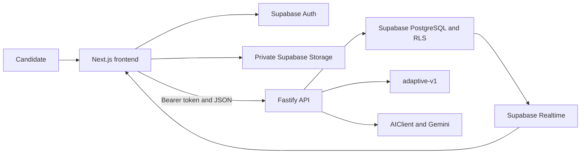

# InterviewForge

**Focused, evidence-led interview preparation for software candidates.**

[](https://github.com/Kunaljeetmuduli/InterviewForge/actions/workflows/ci.yml)
[](https://nodejs.org/)
[](LICENSE)

InterviewForge is an AI-assisted interview practice platform for students,
recent graduates, career switchers, and early-career software candidates. It is
designed to turn a candidate's experience, target role, and practice answers
into realistic interviews, structured feedback, and clear next steps.

The product is intentionally focused: it supports interview preparation without
pretending to predict hiring decisions or measure personality.

## Project status

InterviewForge is under active development. The foundation and identity/data
security release is complete and includes:

- Email and password authentication with session restoration.
- Protected application routes.
- Candidate profiles with target role and experience level.
- A Fastify API with bearer-token authentication.
- Supabase PostgreSQL ownership constraints and Row Level Security.
- A private, PDF-only resume Storage bucket with ownership policies.
- A light-first Forge Blue interface for public and authenticated screens.
- Automated frontend and backend checks through GitHub Actions.

The remaining MVP builds on this secure foundation with resume analysis,
paste-only job descriptions, adaptive interviews, feedback, progress, and a
personalized practice roadmap.

## What makes InterviewForge different

### Practice grounded in context

Interview sessions are designed around the candidate's resume, target role, and
a pasted job description rather than generic question lists.

### Explainable adaptation

The planned `adaptive-v1` engine is deterministic and versioned. AI evaluates
answers, but application rules decide the next topic, difficulty, and follow-up
strategy.

### Useful feedback without a hiring verdict

Evaluations focus on technical correctness, clarity, completeness, relevance,
and observable delivery signals. Every weak area should lead to a practical
next action.

### A text-first accessible experience

Core interviews work through text. Browser-native speech input and playback are
optional enhancements, never requirements.

## Product scope

The MVP is intentionally constrained:

- Interview modes: HR, Technical, Behavioral, and DSA verbal.
- Interview formats: exactly **Quick 5** or **Full 10**, with Quick 5 as default.
- Job descriptions: pasted text only; JD PDF upload is outside the MVP.
- Resumes: private, text-based PDF files up to 5 MB.
- Voice: browser Web Speech APIs with an editable text fallback.
- Adaptive logic: deterministic and stored as `adaptive-v1` per interview.
- AI provider: Gemini behind an application-owned, validated `AIClient`.

## Architecture



InterviewForge uses two independent npm applications in one repository. There
is no root workspace, shared-package orchestrator, or Next.js business backend.

| Layer | Technology |
| --- | --- |
| Frontend | Next.js App Router, React, TypeScript, Tailwind CSS |
| Backend | Node.js 24, Fastify, TypeScript, Zod |
| Data platform | Supabase PostgreSQL, Auth, Storage, Realtime |
| Testing | Vitest, TypeScript, ESLint, production builds |
| AI direction | Gemini through a validated `AIClient` abstraction |
| Deployment direction | Vercel, Render, and Supabase |

## Repository structure

```text
InterviewForge/
|-- frontend/               Next.js application
|-- backend/                Fastify API
|-- supabase/
|   |-- migrations/         Ordered database and Storage migrations
|   `-- verification/       Read-only catalog checks
|-- .github/workflows/      Continuous integration
|-- PRODUCT.md              Public product principles
|-- DESIGN.md               Forge Blue design system
|-- start.bat               Windows development launcher
`-- LICENSE                 MIT License
```

## Getting started

### Prerequisites

- Node.js 24 LTS
- npm 11 or later
- A Supabase project
- Git

Gemini credentials are not required for the currently implemented identity and
profile functionality.

### 1. Clone the repository

```powershell
git clone https://github.com/Kunaljeetmuduli/InterviewForge.git
Set-Location InterviewForge
```

### 2. Install dependencies

The frontend and backend are independent applications:

```powershell
Set-Location frontend
npm install

Set-Location ../backend
npm install

Set-Location ..
```

### 3. Configure environment variables

```powershell
Copy-Item frontend/.env.example frontend/.env.local
Copy-Item backend/.env.example backend/.env
```

Frontend configuration:

```env
NEXT_PUBLIC_SUPABASE_URL=
NEXT_PUBLIC_SUPABASE_PUBLISHABLE_KEY=
NEXT_PUBLIC_API_URL=http://localhost:4000
```

Backend configuration:

```env
NODE_ENV=development
PORT=4000
CORS_ORIGINS=http://localhost:3000
SUPABASE_URL=
SUPABASE_PUBLISHABLE_KEY=
GEMINI_API_KEY=
GEMINI_MODEL=
MAX_PDF_SIZE_MB=5
MAX_INTERVIEW_QUESTIONS=10
AI_TIMEOUT_MS=30000
```

Use Supabase publishable keys in the current applications. Never expose a
service-role key, database password, or Gemini API key to the frontend.

### 4. Apply the Supabase migrations

Review and run these files manually in order against the intended Supabase
project:

```text
supabase/migrations/20260715020000_create_profiles.sql
supabase/migrations/20260715230000_create_mvp_domain_tables.sql
supabase/migrations/20260715231000_create_private_resume_storage.sql
```

Then run the read-only verification script:

```text
supabase/verification/milestone_1_catalog_checks.sql
```

The repository never applies migrations to a remote Supabase project
automatically.

### 5. Start the applications

On Windows, launch both development servers from the repository root:

```powershell
.\start.bat
```

Alternatively, run them separately:

```powershell
# Terminal 1
Set-Location backend
npm run dev

# Terminal 2
Set-Location frontend
npm run dev
```

- Frontend: `http://localhost:3000`
- Backend health: `http://localhost:4000/health`

## Available API

The current release exposes:

| Method | Endpoint | Purpose |
| --- | --- | --- |
| `GET` | `/health` | Unauthenticated service health |
| `GET` | `/api/v1/profile` | Read the authenticated user's profile |
| `PUT` | `/api/v1/profile` | Create or update the authenticated user's profile |

Business endpoints require a Supabase bearer access token. Fastify performs
authorization and Supabase RLS provides defense in depth.

## Quality checks

Frontend:

```powershell
Set-Location frontend
npm run lint
npm run typecheck
npm run build
```

Backend:

```powershell
Set-Location backend
npm run lint
npm run typecheck
npm test
npm run build
```

The GitHub Actions workflow runs the same checks on every push to `main` and on
pull requests. It does not create branches or dependency-update pull requests.

## Design direction

InterviewForge uses a restrained **Forge Blue + Slate** visual system. The
interface is light-first, keyboard-friendly, reduced-motion aware, and designed
to meet WCAG 2.2 AA for primary flows.

The product avoids neon AI styling, gamification pressure, opaque scoring,
decorative motion, and dark-mode-first developer-tool conventions.

## Privacy and responsible AI

InterviewForge handles sensitive career information. The architecture follows
these rules:

- Resume files remain private and user-owned.
- Cross-user database and Storage access is blocked by ownership policies.
- Full resumes, job descriptions, answers, access tokens, and prompts must not
  appear in logs.
- Common direct identifiers are removed before planned AI processing.
- AI output is schema-validated and treated as coaching guidance.
- Expected concepts and evaluation rubrics are never exposed before submission.
- Text mode remains available when voice is unsupported or denied.
- Interview scores are not hiring probabilities or employment decisions.

Do not commit real candidate data or secrets. Local `.env` files are excluded
from Git.

## License

InterviewForge is available under the [MIT License](LICENSE).
