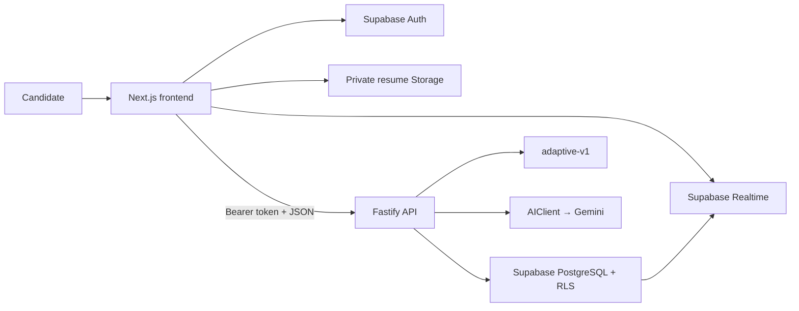

# InterviewForge

InterviewForge is an AI-assisted interview practice platform for students and early-career candidates. It uses a candidate's resume, pasted target job description, submitted answers, and demonstrated weaknesses to run realistic 5-question or 10-question practice interviews and recommend what to improve next.

> Foundation status: documentation, independent application scaffolds, initial Forge Blue UI shell, and backend health check. Authentication, database migrations, AI integration, resume processing, and interview logic intentionally begin in later milestones.

## Product decisions

- Job descriptions are **paste-only** in the MVP; there is no JD PDF upload.
- Interviews contain exactly **5 or 10 questions**; 5 is the default.
- The deterministic adaptive engine begins at **`adaptive-v1`** and is fixed per interview.
- Voice uses browser-native Web Speech APIs and always has an editable text fallback.
- The interface follows the light-first **Forge Blue + Slate** design system.

## Architecture



The repository contains two independent npm applications. It does not use npm workspaces, Turborepo, Nx, or a shared root package.

```text
InterviewForge/
├── frontend/                 Next.js App Router application
├── backend/                  Fastify TypeScript API
├── supabase/migrations/      Ordered SQL migrations (later milestone)
├── docs/                     Focused implementation references and ADRs
├── .github/workflows/        Independent application CI
├── PRODUCT.md                Product strategy and design intent
├── DESIGN.md                 Machine-readable visual system and rules
├── PLAN.md                   Milestones, gates, and test matrix
└── INTERVIEWFORGE_ARCHITECTURE.md
```

## Technology

| Area | Choice |
| --- | --- |
| Frontend | Next.js App Router, React, TypeScript, Tailwind CSS, Geist, Lucide |
| Backend | Node.js 24 LTS, Fastify, TypeScript, Zod, Vitest |
| Platform | Supabase PostgreSQL, Auth, private Storage, Realtime |
| AI | Gemini via the official Google GenAI SDK behind `AIClient` |
| Voice | Browser `SpeechRecognition` and `speechSynthesis` with text fallback |
| Deployment | Vercel frontend, Render backend, Supabase platform |

## Prerequisites

- Node.js 24 LTS
- npm 11+
- Git

Later milestones also require Supabase and Gemini projects. Do not create production secrets for the foundation milestone.

## Local development

Install each application independently:

```powershell
Set-Location frontend
npm install

Set-Location ../backend
npm install
```

Copy environment examples only when a milestone needs them:

```powershell
Copy-Item frontend/.env.example frontend/.env.local
Copy-Item backend/.env.example backend/.env
```

Run the backend in one terminal:

```powershell
Set-Location backend
npm run dev
```

Run the frontend in another terminal:

```powershell
Set-Location frontend
npm run dev
```

Default local endpoints:

- Frontend: `http://localhost:3000`
- Backend health: `http://localhost:4000/health`

## Verification

Run frontend checks:

```powershell
Set-Location frontend
npm run lint
npm run typecheck
npm run build
```

Run backend checks:

```powershell
Set-Location backend
npm run lint
npm run typecheck
npm test
npm run build
```

The GitHub Actions workflow runs the same independent checks from clean installs.

## Documentation map

- [Product strategy](PRODUCT.md)
- [Visual design system](DESIGN.md)
- [Implementation plan](PLAN.md)
- [Master product and system architecture](INTERVIEWFORGE_ARCHITECTURE.md)
- [Architecture guide](docs/ARCHITECTURE.md)
- [API contract](docs/API.md)
- [Database and security model](docs/DATABASE.md)
- [Local development](docs/DEVELOPMENT.md)
- [Privacy and AI safety](docs/PRIVACY_AND_AI_SAFETY.md)
- [Contributing](CONTRIBUTING.md)
- [Security policy](SECURITY.md)

## Safety and privacy

InterviewForge handles resumes, job descriptions, and interview answers. Never commit secrets or real candidate data. Never log complete source documents, answers, access tokens, API keys, or raw prompts containing personal data. AI-generated scores are coaching signals, not hiring probabilities or employment decisions.

## License

Licensed under the [MIT License](LICENSE).
