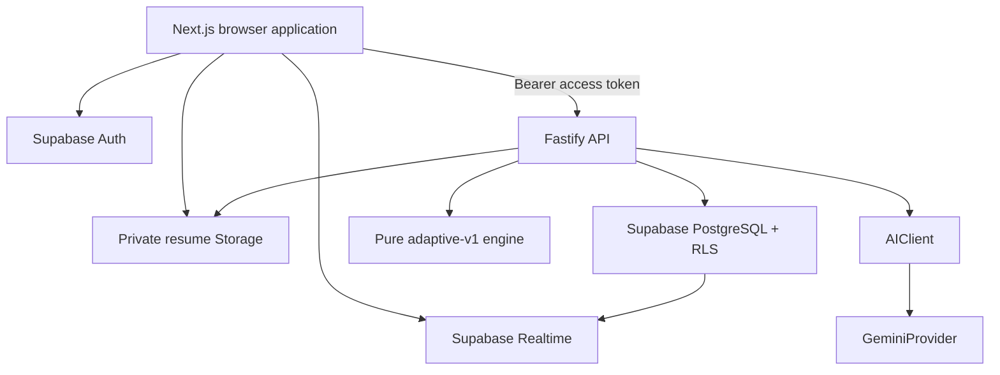

# Architecture Guide

The authoritative specification is `INTERVIEWFORGE_ARCHITECTURE.md`. This guide is the short implementation map; it does not override the master document.

## Runtime topology



## Authority boundaries

| Component | Owns | Must not own |
| --- | --- | --- |
| Frontend | Presentation, browser session, permitted uploads, Realtime subscription, voice transcript, API calls | Database business logic, authorization decisions, secret keys |
| Fastify | Authentication validation, ownership checks, workflows, AI orchestration, interview/evaluation rules, response mapping | Browser rendering, RLS policy enforcement |
| Supabase | Identity, persistence, row ownership enforcement, private files, status notifications | Interview adaptation or AI evaluation logic |
| `AdaptiveEngine` | Deterministic topic/difficulty/follow-up selection | HTTP, database, AI calls, mutable global state |
| Gemini | Structured extraction, fallback question generation, answer evaluation | Authorization, database access, final adaptive rules, arbitrary resource URLs |

## Backend layering

```text
Route → Controller → Service → Repository
                         ↘ AIClient
                         ↘ AdaptiveEngine
                         ↘ Curated data
```

- Routes define HTTP, authentication, and request/response schemas.
- Controllers translate validated requests and application results.
- Services own workflows and business rules.
- Repositories own Supabase queries and row mapping.
- Cross-cutting configuration, errors, logging, and providers live under `src/core` or `src/plugins`.

## Non-negotiable invariants

- Business APIs live under Fastify `/api/v1`; `/health` is intentionally unversioned.
- Frontend and backend are independent npm applications.
- Every user-owned table has RLS and indexed `user_id` ownership.
- `question_limit` is 5 or 10, with 5 as the product default.
- `adaptive_engine_version` is immutable after interview creation.
- Questions preserve source and question-bank provenance.
- Expected concepts and private rubrics are withheld until answer submission.
- Answers persist before evaluation and are idempotent by `(interview_id, client_request_id)`.
- JD input is pasted text only; there is no JD file pipeline.
- Untracked background promises are prohibited on free hosting.

## Architecture decisions

Material changes require an ADR using `docs/decisions/0000-template.md`. Accepted ADRs extend or supersede named parts of the master document; they never silently contradict it.
